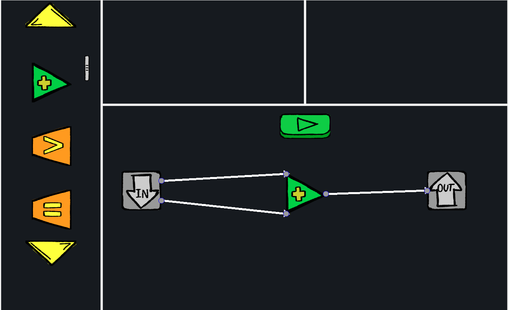

# LunarBlocks
*Submission for HackTheU: Go Beyond hackathon (Fall 2020).*

**Created by:** Jan Garong, Jesse Maltese, Yining Wang, Rahul Sharma

**Built with:** pygame, pygame_gui

A simple game that would help younger students understand programming.

## Inspiration
With [the Ontario Math Curriculum now adding a coding component to Grades 1-8](https://www.cnn.com/2020/06/23/americas/ontario-math-curiculum-trnd/index.html#:~:text=Court%20confirmation%20hearings-,Ontario%20schools%20will%20now%20teach%20first%20graders%20financial%20literacy%20and,for%20jobs%20of%20the%20future&text=The%20new%20curriculum%2C%20announced%20by,the%20course%20of%20two%20years.), we want to develop a game/tool that will help younger students develop their coding skills, without having to write code.

## What it does
It is aimed at the youngest group of kids. Here kids can practise simple algorithms like largest in 3 integer numbers, by interactively playing with fun shapes and 
basic mathematical operators. Kids will also be able to develop basic understanding of loops and interative perspective to look at problems.

## How we built it
We hold group conference at the beginning of the hackathon, brainstormed, and come up with the idea to develop a game that benefits the younger students in computer science learning. Then we assigned task to every team member by grouping people into frontend and backend, and had online meetings to check the progress. By developing the game in python and pygame, we implemented the demo of LunarBlocks.

## Challenges we ran into
We confronted challenges when we tried to connect UI with backend. We found that there was diversion on functionality of some classes.

## Accomplishments that we're proud of
We are proud of having an working Backend and robust Frontend along with, many assets reaady for the game. The Backend is such that it can be scaled up for even 
more complex levels and fucntions. On the other hand, The frontend is dynamic and interactive to pique the interest of kids. The assets, bring the game to life
by giving the game its cute and playful theme. We are proud to have these in place so that we can extend this project easily into what we aimed ofr in the start,
a cute interactive game that helps kids develop their algorithmic abilities.

## What we learned
We learned that having strong communication in terms of specifying requirements is essential especially if the your work is going to be used by others. This ensures that the developed code fits with the expectation of everyone. Furthermore this also gives everyone a feeling of understanding and direction for the project.

## What's next for LunarBlocks
Ideally, we would like to add more levels, more operations, and a sandbox mode! As well, a good tutorial would be valuable as the learning curve for the game still feels too high for our target audience. As well, giving the game more of a theme would be fun - as the name suggests we originally intended for it to be Space themed but that didn't work out. It would give the game quite a bit more character to have some fun, themed assets. We'd also like to turn it into a web app as we found PyGame to be quite clunky at times. The future is bright for LunarBlocks! 

## Image Gallery

